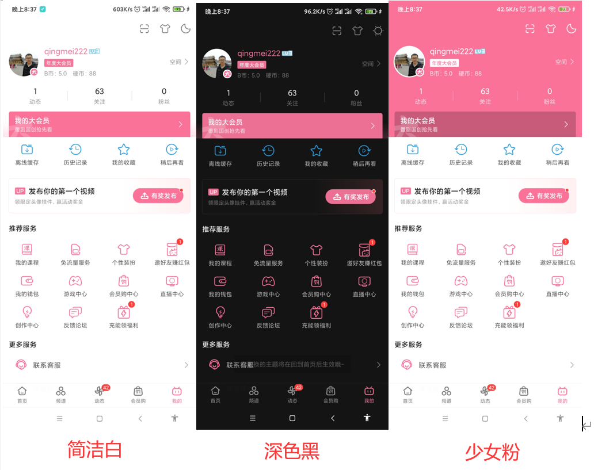

# 反思 | 开启B站少女心模式，探究APP换肤机制的设计与实现

## 概述

**换肤功能** 并非奇技淫巧，而是已非常普及，尤其当`Android Q`推出了 **深色模式** 之后，国内绝大多数主流应用都至少提供了 **日间** 和 **夜间** 两种模式。

对于无感的用户而言，这个功能实属鸡肋，但从另外一个角度上来说，这也是产品在雕琢 **用户极致体验** 过程中的一次尝试，为不同情景下，不同偏好的用户提供更多的选择性。

以 **哔哩哔哩** 为例，除了提供以上两种主题之外，还免费提供了充满 **少女心** 的粉色主题：



从产品的前瞻性上来看，国内在换肤功能的探索较国外是领先的，抽象的来看待`Android Q`的 **深色模式**，也无非是新增一种主题罢了，因此，开发者应该将角度放在更高的层级上：**为产品提供一套完善的换肤方案**，而非仅仅是  **适配深色模式** 。

想清楚这一点，开发者就不会将目光仅局限于技术本身——对于整个换肤体系而言，涵盖了UI、产品、开发、测试、运维等多名角色不同的关注点，而这些关注点最终却都依赖研发协助做决策，举例如下：

* **UI**：定义不同的UI组件不同的颜色属性，这些属性最终在不同的主题下，代表不同的颜色（日间模式下标题是黑色，但是夜间模式下，标题应该是白色）。
* **产品**：定义换肤功能的业务流程，从简单的换肤主页，换肤的交互，到不同主题下的不同展示、付费策略等等。
* **开发**：提供换肤功能的研发能力。
* **测试**：保证换肤功能的稳定性，比如自动化测试和便捷取色工具。
* **运维**：保证线上问题的快速定位和及时解决。

除此之外，还有更多可以深入思考的技术点，比如，随着主题越来越多，势必导致`APK`包体积的增大，是否有必要引入远程动态加载（`download & install`）的能力？借助不同角色的视角，我们可以提前规划好远景，接下来的编码也就更加遂心应手。

本文将针对 `Android` 应用整个换肤体系进行概括性的描述，读者应抛开对 **技术实现的细节** 的执著，从不同角色的需求去思考，**窥一斑而知全豹** ，为产品打造出健壮有力的功能实现。

## 一、定义UI规范

换肤规范的目的是什么？对于UI设计和开发人员而言，设计与开发都应该基于统一且完整的规范之上进行，以掘金APP为例：


对于UI设计人员，在APP不同的主题下，控件的颜色不再是一个单一的值，而应该用一个通用的`key`来进行定义，如上图所示，「标题」的颜色，在日间应该是黑色`#000000`，而深色模式下则应该为白色`#FFFFFF`，同理，「次级标题」、「主背景色」、「分割线颜色」，都应该随着不同的主题下，对应不同的值。

设计人员在设计时，仅需要针对页面每一个元素填充好对应的`key`，根据规范很清晰地完成UI设计：

||日间模式|深色模式|备注|
|-|-|- ||
|skinPrimaryTextColor|#000000|#FFFFFF|标题字体颜色|
|skinSecondaryTextColor|#CCCCCC|#CCCCCC|次级标题字体颜色|
|skinMainBgColor|#FFFFFF|#333333|页面主背景色|
|skinSecondaryBgColor|#EEEEEE|#000000|次级背景、分隔线背景色|
|其他更多...|| ||
|skinProgressBarColor|#000000|#FFFFFF|进度条颜色|

这对于开发人员的效率提升更加明显，开发者不再需要关心具体颜色的值，只需要将对应的`color`填充到布局中即可：

```xml
<TextView
    android:layout_width="wrap_content"
    android:layout_height="wrap_content"
    android:text="Hello World"
    android:textColor="@color/skinPrimaryTextColor" />
```

## 二、构建产品化思维：皮肤包

如何衡量一个开发人员的能力——对复杂功能快速、稳定的交付？

如果只是单纯的认可这个理念，那么对于换肤功能的实现反而简单了，以标题颜色`skinPrimaryTextColor`为例，我只需要声明两个`color`资源：

```xml
<?xml version="1.0" encoding="utf-8"?>
<resources>
    <color name="skinPrimaryTextColor">#000000</color>
    <color name="skinPrimaryTextColor_Dark">#FFFFFF</color>
</resources>
```

笔者成功摆脱了复杂的编码实现，在`Activity`中我只需2行代码即可：

```java
public void initView() {
  if (isLightMode) {    // 日间模式
     tv.setTextColor(R.color.skinPrimaryTextColor);
  } else {              // 夜间模式
     tv.setTextColor(R.color.skinPrimaryTextColor_Dark);
  }
}
```

这种实现并非一无是处，至少暂时保住了笔者为数不多的发囊。

当然还可以说这种方案有优化空间，比如提供封装的工具方法 **看似摆脱** 无尽的`if-else`：

```java
/**
 * 获取当前皮肤下真正的color资源，所有color的获取都必须通过该方法。
 **/
@ColorRes
public static int getColorRes(@ColorRes int colorRes) {
  // 伪代码
  if (isLightMode) {     // 日间模式
     return colorRes;    // skinPrimaryTextColor
  } else {               // 夜间模式
     return colorRes + "_Dark";   // skinPrimaryTextColor_Dark
  }
}

// 代码中使用该方法，设置标题和次级标题颜色
tv.setTextColor(SkinUtil.getColorRes(R.color.skinPrimaryTextColor));
tvSubTitle.setTextColor(SkinUtil.getColorRes(R.color.skinSecondaryTextColor));
```

> 很明显，`return colorRes + "_Dark"`这行代码作为`int`类型的返回值是不成立的，读者无需关注具体实现，因为这种封装仍 **未摆脱笨重的 if-else 实现** 的本质。

可以预见，随着主题数量逐步增多，换肤相关的代码越来越臃肿，最关键的问题是，所有控件的相关颜色都强耦合于换肤相关代码本身，每个UI容器（`Activity`/`Fragment`/自定义`View`）等需要追加`Java`代码手动设置。

此外，当皮肤数量达到一定规模时，`color`资源的庞大势必影响到`apk`体积，因此主题资源的动态加载发势在必行，用户安装应用时默认只有一个主题，其它主题 **按需下载和安装** ，比如淘宝：


到了这里，**皮肤包** 的概念应运而出，开发者需要将单个主题的颜色资源视为一个 **皮肤包**，在不同的主题下，对不同的皮肤包进行加载和资源替换：

```xml
<!--日间模式皮肤包的colors.xml-->
<resources>
    <color name="skinPrimaryTextColor">#000000</color>
    ...
</resources>

<!--深色模式皮肤包的colors.xml-->
<resources>
    <color name="skinPrimaryTextColor">#FFFFFF</color>
    ...
</resources>
```

因此，开发有必要站在产品的角度，根据需求权衡不同的实现方案，找到适合自身产品的技术选型和开发周期，最后动手编码。

## 三、整合实现思路


### 1.核心实现：LayoutInflater.Factory2


读者应该知道，
